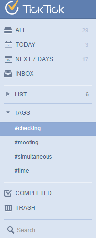

###How to add tag to a task?

Tags help you filter your to-dos across multiple lists. To tag a to-do, simply add a hashtag to a keyword. But before that you need to enable Tags in Labs. 

1.Click the avatar in the upper-right hand of the page to select “Labs”.

2.Enable “Tags”.

3.You will find "TAGS" list in the List page.

Tag is another way to group tasks, which is especially used to add context for your tasks. You can add up to 5 tags to each task. When clicking “TAGS” on the left panel, you will be directed to the list, where all tasks labeled by this tag will be displayed.

