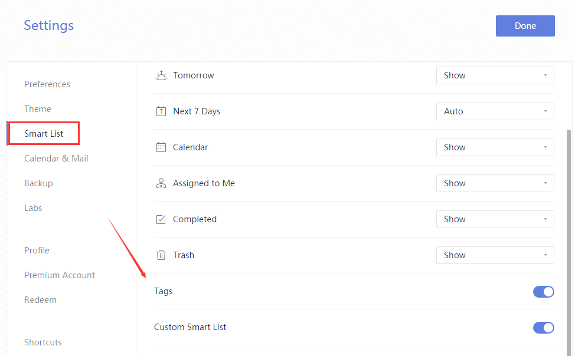

### How to add tags to a task?

Tags let you search across multiple lists for tasks that share common tags. This allows for a faceted search of your information. To activate this feature, you must first enable "Tags" in the "Labs" menu. Here's how:

1. Sign in to TickTick on the web.

2. Click the avatar in the upper-left corner of your TickTick homepage, then click "Settings" from the menu that appears.

3. Click "Smart List" in the left panel, and enable "Tags" in the right panel.

To tag a task item, simply add a hashtag to a keyword in that item \(for example, \#Holiday\). You may use a maximum of five tags per task.

You can view a list of the tags you've created in the "Tags" list in the sidebar.

