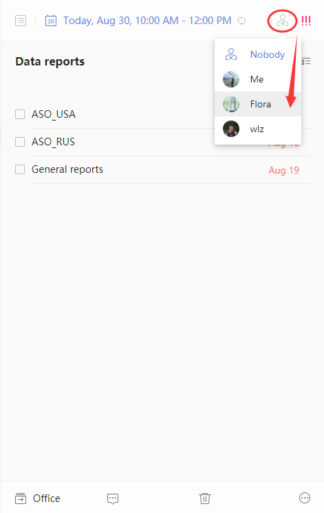

### How to assign a task?

In TickTick you can assign tasks in a shared list. The person you assign tasks to must first accept your invitation to a shared list before becoming responsible for that task.

1. Sign in to TickTick on the web.

2. Choose a task in the shared list.

3. Click the assignment icon in the upper-right corner of the page to choose an assignee.

