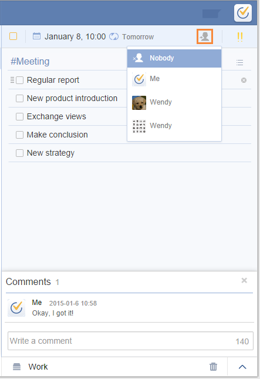

###How to assign a task to others?
Assiging a task currently is only possible within a shared list.

1.Click a task in a shared list first.

2.Click the assignment icon in task detail page and choose the one who you want to assign to.

And then, you will see the avatar of the assigned person at the end of the task. Meanwhile, the assignee will receive a notification.

