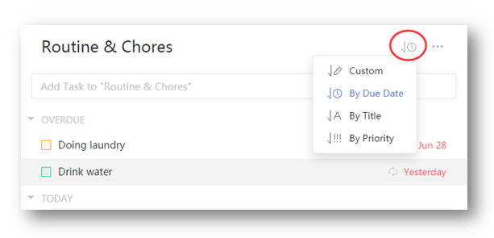

###How to change order of the tasks?
1.Sign in TickTick on web.

2.Select a list first and click the “View” icon.

Tasks under self-defined lists and “Inbox” can be sorted by order, due date, title, and priority. Tasks in a shared list can be sorted by assignee, and tasks in “All” can be sorted by list.

Tasks in “Today” and “Next 7 Days” can't be sorted automatically. Instead you can drag and drop tasks to change their order.

