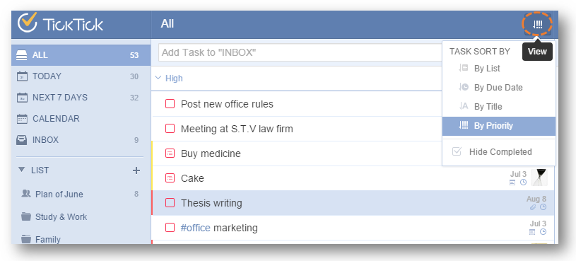

###How to change order of tasks within a list?
1.Sign in TickTick on web.

2.Select a list first and click the “View” icon.

3.Then, you can sort tasks by due dates, title, order, priority, assignee (shared lists only), or list (“All” list only).

If you select “by title”, tasks will be ordered alphabetically. If you choose “by order”, you can manually drag tasks to change their order.

 
