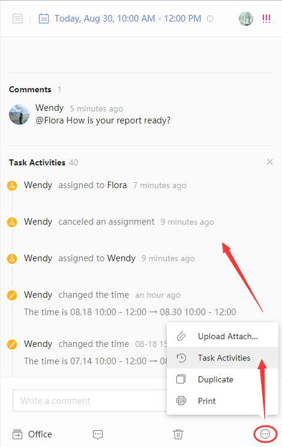

###How to check task activities? (Premium)
1. Sign in to TickTick on the web.

2. Click the avatar in the upper-left corner of your TickTick homepage, then click "Settings" from the menu that appears. 

3. Select "Labs" in the left panel and then enable "Task Activities" in the right panel.

4. Click "done" to return to your TickTick homepage, then click on any task, and click the "···" icon on the bottom of the right panel.

5. Choose "Task Activities" to check all modification records.
