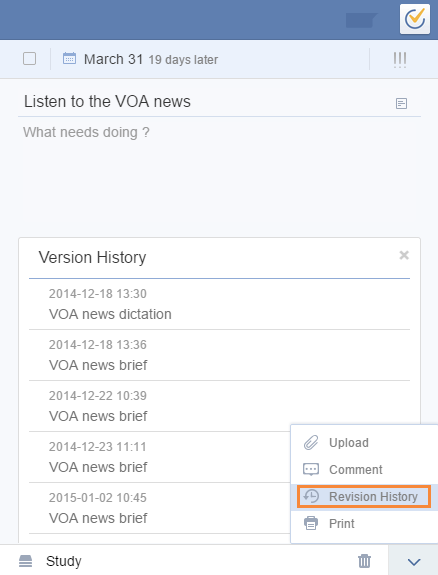

###How to check revision history of a task? <mark>[Pro only]</mark>
1.Click avtar on top right corner to enter “Labs” to enable it first.

2.Select a task, and click the upward arrow on bottom right corner in task detail page.

3.Choose “Revision History” to check all modification records.

