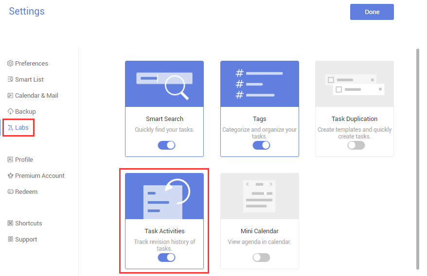
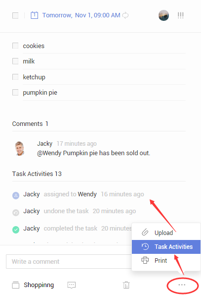

###How to check activities of a task? <mark>[Pro only]</mark>
1.Sign in TickTick on web.

2.Click avtar in the upper-left corner of the page to select “Settings”.

3.Select “Labs” in the left panel and then enable “Task Activities”.

4.Select a task, and click the “···” in the bottom right corner of the page.

5.Select “Task Activities” to check all modification records.

