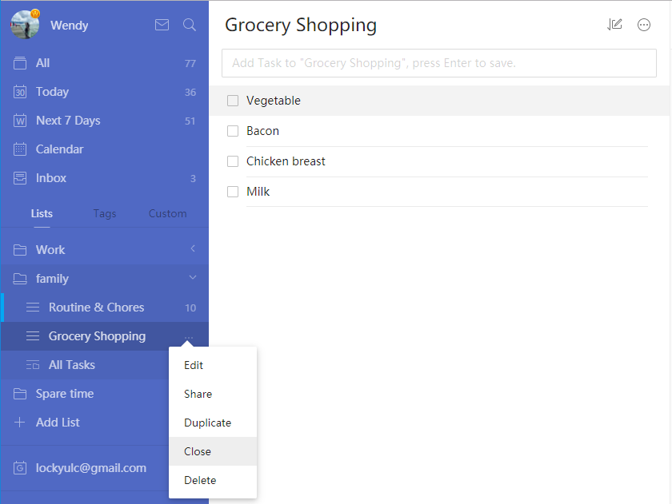
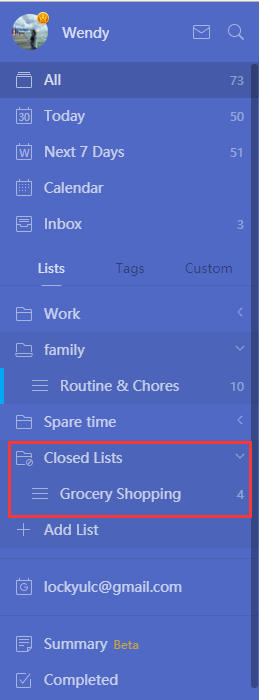

### How to close an inactive lists so they don't appear on the sidebar?

1. Sign in to TickTick on the web.

2. Click the "···" button in the sidebar to the right of each list's name. \(Note that this button is hidden until the mouse hovers over it. When the mouse is not hovering over it, it shows a number indicating the total tasks contained in the list\).

3. Click "Close", then click "OK" for confirmation.

Closing inactive lists helps streamline your TickTick homepage sidebar and improve TickTick's performance. If you don't want to delete the list, closing it will save its contents in TickTick. However, please note that tasks on closed lists will not be displayed in "All", "Today", "Next 7 Days" or search results. In addition, you will not be reminded of tasks in a closed list.

