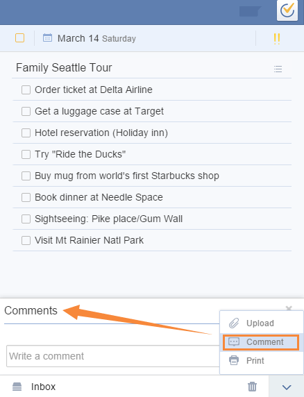

###How to comment on a task?

1.Select a Task.

2.Click the upward arrow on bottom right corner in task detail page.

3.Select “Comment” to add your remarks.

“Comment” is always used to add extra remarks to a task. Within a shared list, all shared members can comment on any task of this list to realize real chat & communication.

