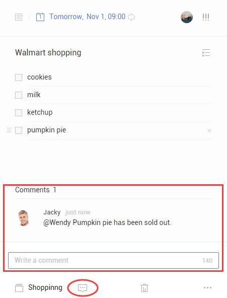

### How to comment on a task?

1. Sign in to TickTick on the web.

2. Select a task, then click the Comment button at the bottom of the right panel.

3. Type a comment into the text field that appears above the Comment button.

4. Use "Comment" to add extra remarks to a task.

Within a shared list, all members can comment on any task. This enables more effective communication. If you want to send a shared member a message or reply a member in a shared list, you can type "@" to select a member or click the person's avatar to reply to someone directly.

The members you contact or reply to will receive immediate notification in their TickTick apps.

