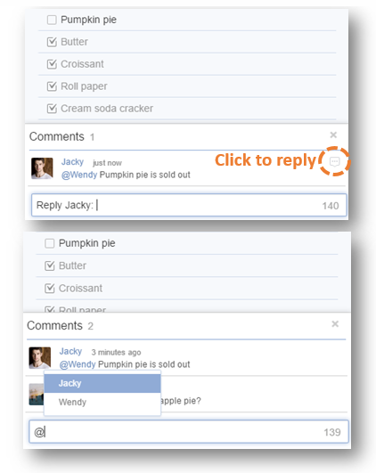
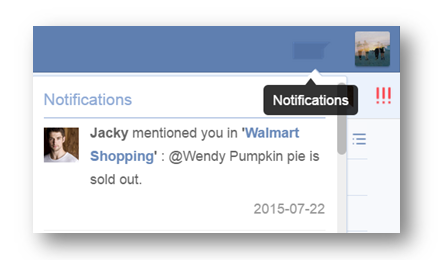

###How to comment on a task?

1.Sign in TickTick on web.

2.Select a Task and click the upward arrow in the bottom right corner of the page.

3.Select “Comment”.

“Comment” is always used to add extra remarks to a task. 

Within a shared list, all shared members can comment on any tasks to realize real chat & communication. If you want to @reply a member in a shared list, you can type “@” to select a member or click the icon to reply someone directly. 

The member you @reply will get notification in TickTick immediately. 

