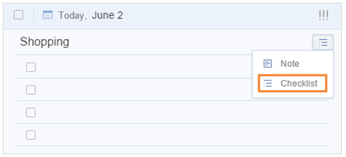

### How to create a checklist?

Checklist is always used to add subtasks such as shopping list, to break big tasks into small ones such as family trip arrangement or to create tasks involving multiple steps.

 

