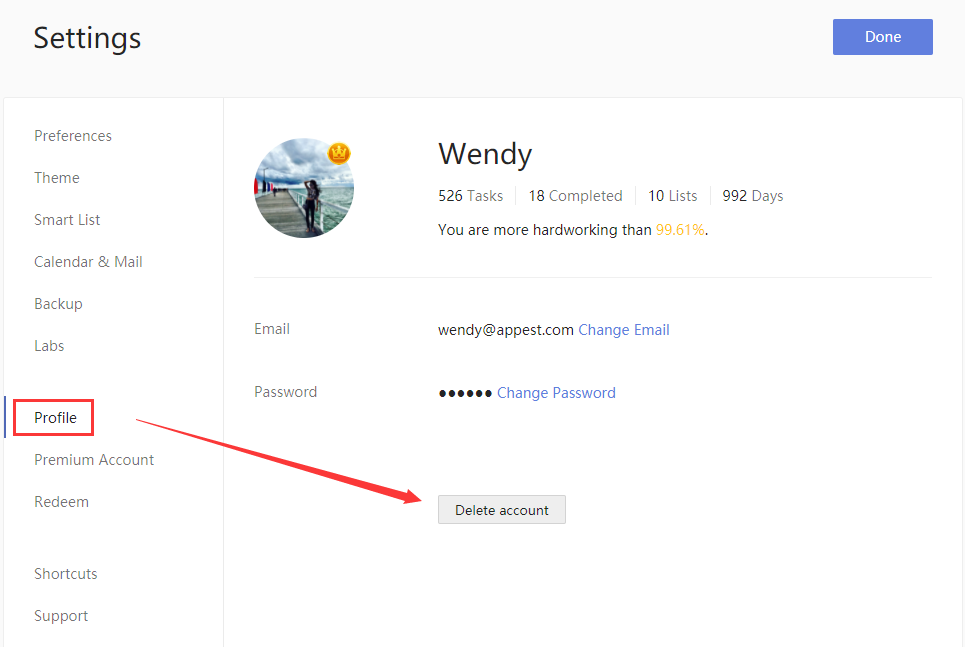
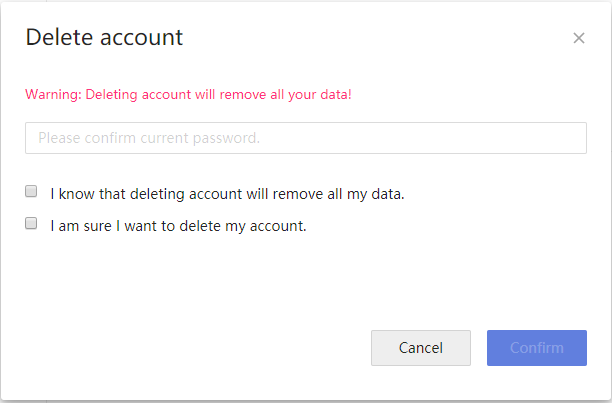

###How to delete my account?

Are you sure you want to delete your account? We feel sorry that you wish to leave us.

You are always welcome to contact us if you have any questions, comments, or issues with TickTick.

1. Sign in to TickTick on the web.

2. Click the avatar in the upper-left corner of your TickTick homepage, then click "Settings" from the menu that appears. 

3. Click "Profile" in the left panel.

4. Click the "Delete account" button.

Deleting your account will remove all your data from TickTick. To help prevent against an unintended loss of information, you will be asked to confirm your TickTick password before proceeding. If you have forgotten your password, reset your password first and then delete your account. You may make a backup file of your TickTick data for future use (see section 2.3.1).

