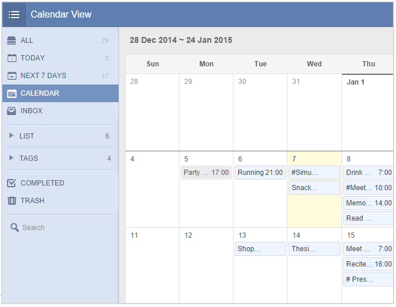

# 3. How to check tasks in Calendar View ?
"Calendar View" is a premium feature available for PRO users only. It allows you to check tasks in Calendar view, which is more intuitive and clear.

1.Click the avatar on top right corner to enter "Labs" and enable "Calendar View".

2.Then you will see the "CALENDAR" tab appear below the "NEXT 7 DAYS" on the left panel.

3.Click "CALENDAR" and you are able to check your tasks in a more familiar way just like in Calendar. Click on any date to add tasks directly or click the task to edit.

