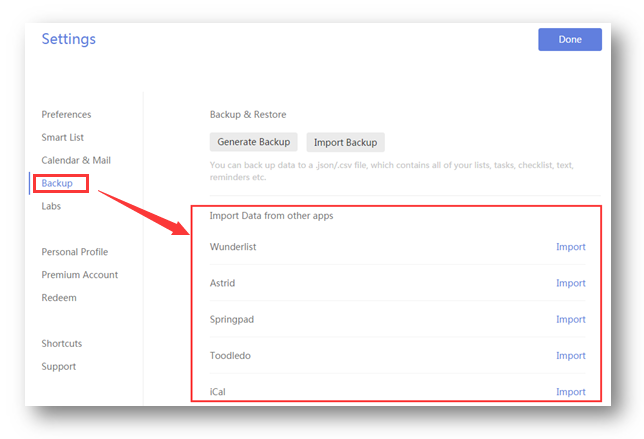

###How to import tasks from other apps into TickTick?
1.Sign in TickTick on web.

2.Click the avatar in the upper-left hand corner of the page.

3.Click “Settings” > “Backup”.

TickTick allows you to import tasks from other to-do apps such as Astrid, Wunderlist, Toodledo.

