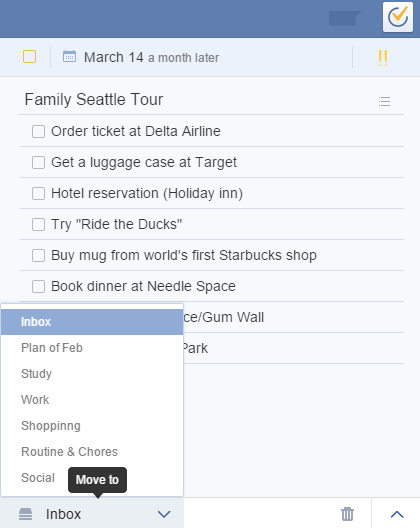

### How to move a task in another list ?
**Option 1: Choose a list for a task**
 

1.Select a task.

2.Click the list name at the bottom of the right panel.

3.Choose one list to fulfill the movement.

**Option 2: Drag a task directly to another list**
 

You can move a task to another list dirctly by manual drag.

