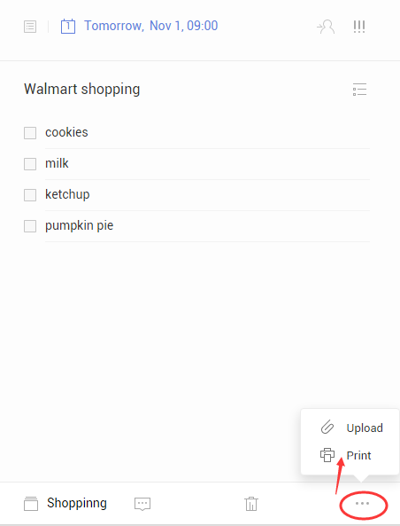

###How to print a task?

1.Sign in TickTick on web to select a task.

2.Click the “···” in the bottom right corner of the page.

3.Select “Print”.

Before printing, print preview allows you to view what a printed version of the document would look like on the screen. You can change paper size, margins, ect.

