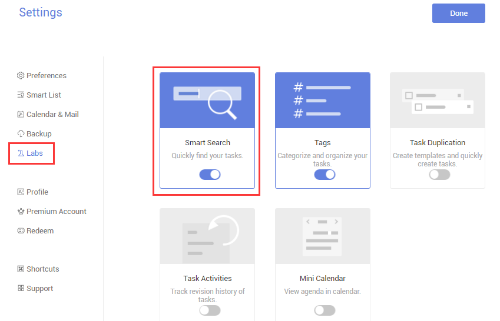
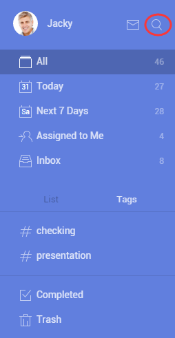

###How to search a task?
1.Sign in TickTick on web.

2.Click the avatar in the upper-right hand of the page to select “Settings” > Click “Labs” in the left panel.

3.Enable “Smart Search”.

After that, “Search” will be displayed in the upper-left hand of the page.

