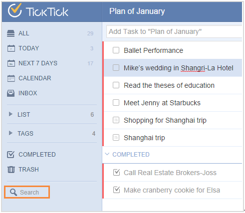

###How to search a task?
1.Click the avatar on top right corner to enter “Labs”.

2.Enable “Smart Search”.

The icon of “Search” will be on the bottom of the left panel. Enter keywords directly or click the downward arrow in search column to use “Advanced Search”, where you can narrow your search by choosing a list, selecting due date range and task status.

