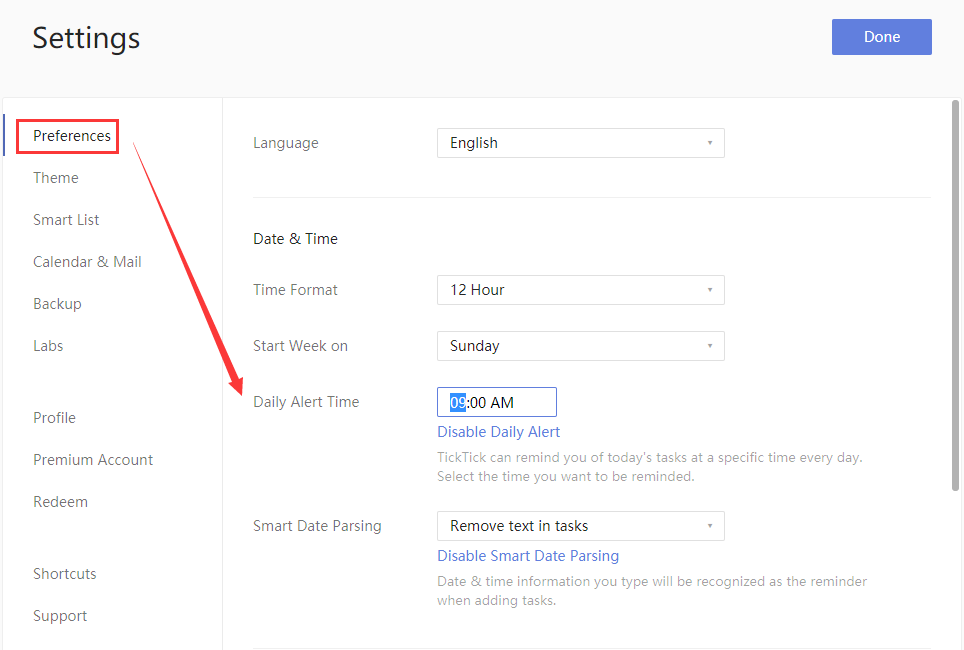

###What is "Daily Alert" ?
A Daily Alert is a daily reminder summarizing all your overdue and today's tasks, and you set the time of day when you wish to receive this reminder.

**How to set daily alert time?**

1. Sign in to TickTick on the web.

2. Click the avatar in the upper-left corner of your TickTick homepage, then click "Settings" from the menu that appears. 

3. In the "Daily Alert Time" section, set a time when you would like your daily reminder to occur.

If you set "Daily Alert Time" at 9:00 AM, you will receive a notification at 9:00 AM every day with a summary of all your overdue & today's tasks.
