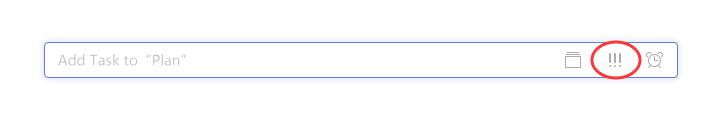
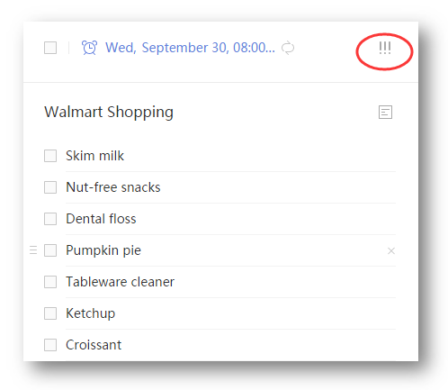

###How to set priority of a task?

Sign in TickTick on web.

You can add priority when adding tasks.

Or you can select a task and then click “!!!” in the upper-right hand corner of the page. You can select “High”, “Medium”, “Low”.

