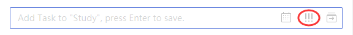
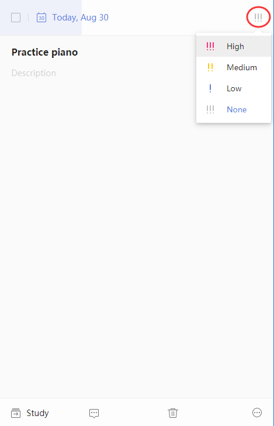

### How to set priority of a task?

1. Sign in to TickTick on the web.

2.1.For new tasks, click the "!!!" button, then choose a priority level for that task.

2.2. For existing tasks, click the "!!!" button at the top-right corner of the right pane, then choose a priority level for that task.

