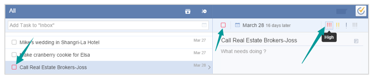

###How to set priority of a task?
Select a task and then click the icon of “!!!” on the top right corner in task detail page.

You can set “High”, “Medium”, “Low” and “No Priority” for a task. Then it will be displayed by the color of the checkbox in the list detailed page.

