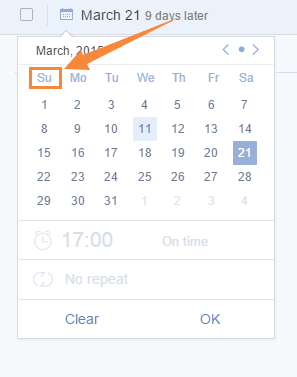

###Where is “Start Day of Week” used?
1.Due date calendar  

2.Mini calendar (turn to 1.5.4 for details) 

 

**-How to change “Start Day of Week”?**
 

1.Click the avatar on top right corner

2.Enter “Settings” and click  “Preferences”.

3.Choose Sunday, Monday, or Saturday as the start day of week.
