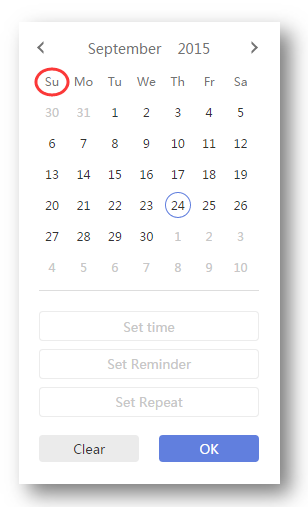
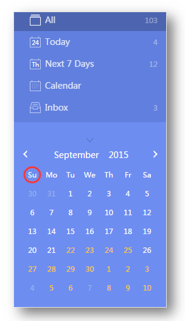

### How to set the first day of the week?

1. Sign in to TickTick on the web.

2. Click the avatar in the upper-left corner of your TickTick homepage, then click "Settings" from the menu that appears. 

3. From the "Start Week On" drop-down menu, choose Saturday, Sunday, or Monday as the first day of the week in TickTick.
 

**Where is it used?**

1. Due date calendar

2. Mini calendar (see section 1.7.4 for details)

 

