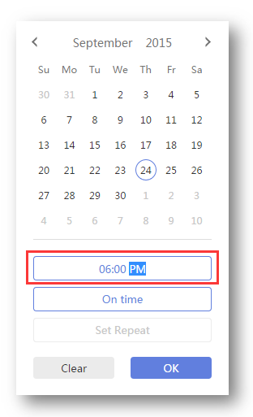

###  How to set time format?
1.Sign in TickTick on web.

2.Click the avatar in the upper-left hand corner of the page to select “Settings”.

3.In the “Time Format” section, select “12 Hour” or “24 Hour”.

-**Where is it used?**

Time format is mostly used when you set due date.

