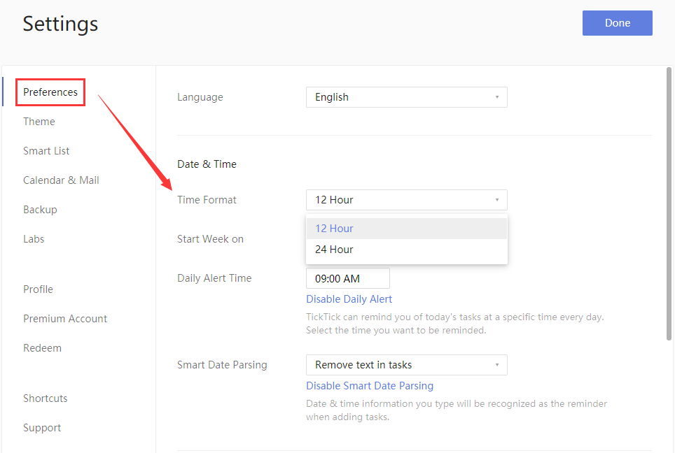
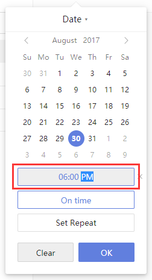

### How to set time format?

1. Sign in to TickTick on the web.

2. Click the avatar in the upper-left corner of your TickTick homepage, then click "Settings" from the menu that appears.

3. In the "Time Format" section, select "12 Hour" or "24 Hour".

**How is time format used in TickTick?**

Time format is most relevant to your due dates.

