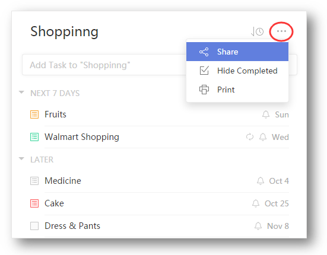
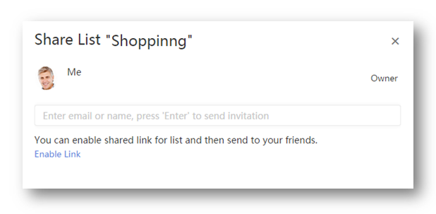
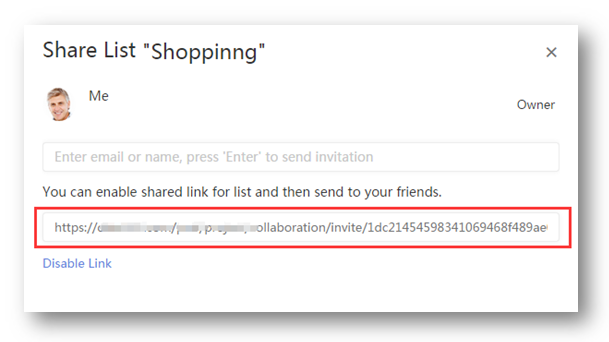

###How to share lists with TickTick users?

There are two ways to share lists.

####Option 1:

1.Sign in TickTick on web.

2.Click the "..." icon in the upper-right hand of the middle panel to select "share".

3.Enter email address directly to add a recipient. Then recipients will be notified by email to accept your sharing invitation.

####Option 2:Shared via link

1.Sign in TickTick on web.

2.Click the “···” in the upper-right hand of the middle panel to select “Share”.

3.Click “Enable Link” to copy the link and send it to other TickTick users.

 

**-Should I upgrade to Pro to join shared lists?**

No! Recipients are always free to accept shared lists.

