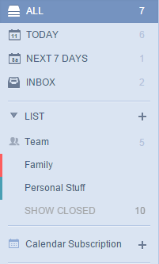

# 4. How to show events from other calendar services in TickTick?
This is a premium feature open to PRO users only, which allows you to subscribe events from other calendar services in TickTick.

1.Click the avatar on top right corner to enter "Labs" to enable "Calendar Subscription".

2.The "Calendar Subscription" tab will be added above "Completed" list on the left panel  

3.Click "+" and input the calendar URL you want to subscribe. Please note the calendar URL can be got from your calendar settings.

