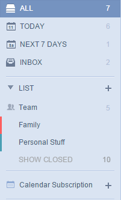

###How to subscribe my calendar in TickTick? <mark>[Pro only]</mark>
This feature allows you to add events from other calendar services to TickTick.

 
####**-How to do?**

<iframe width="700" height="400" src="https://www.youtube.com/embed/zCsCP4VBUX4?list=PLbWRKVi0_aTH4wo0Z2kCuMy7RHV7t9onw" frameborder="0" allowfullscreen></iframe>

1.Click the avatar in the upper-right hand of the page to select “Labs”.

2.Enable “Calendar Subscription”.

3.The “Calendar Subscription” tab will appear on the left panel.

4.Click “+” and input the calendar URL from a third-party calendar app.

-**How to get a calendar URL?**

Take Google Calendar as an example:

1.Select Settings of a calendar.

2.Click the calendar you want to add to TickTick.

3.Click ICAL in the “Private Address” section.

4.Copy the link to TickTick. 

