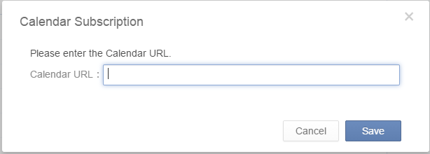

###How to subscribe my calendar in TickTick? <mark>[Pro only]</mark>
This feature allows you to subscribe events from other calendar services such as Google Calendar in TickTick.

 
####**-How to do?**

1.Click the avatar on top right corner to enter “Labs” to enable “Calendar Subscription”.

2.The “Calendar Subscription” tab will appear above “Completed” list on the left panel

3.Click “+” and input the calendar URL you want to subscribe.

Please note the calendar URL can be got from your calendar settings. Take Google Calendar as an example:

<iframe width="700" height="400" src="https://www.youtube.com/embed/zCsCP4VBUX4?list=PLbWRKVi0_aTH4wo0Z2kCuMy7RHV7t9onw" frameborder="0" allowfullscreen></iframe>

