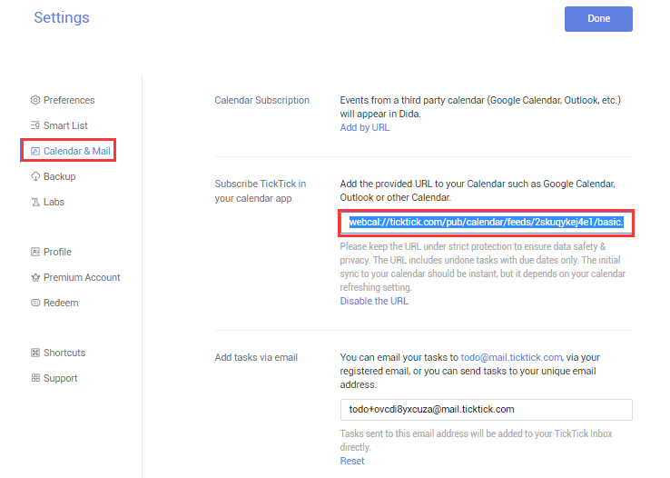

### How to subscribe TickTick in my own calendar app?

1.Sign in TickTick.

2.Click the avatar in the upper-left hand corner of the page.

3.Select “Settings” > “Calendar & Mail”.

4.Click “Enable the URL” in the section of “Subscribe TickTick in your calendar app”.

5.Add the provided URL to your calendar apps.

