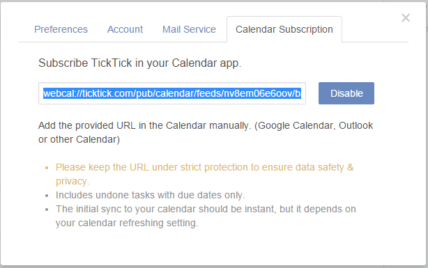
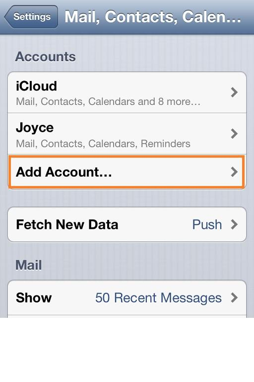
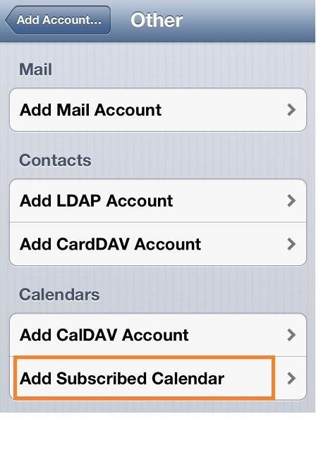

### How to subscribe TickTick in my own calendar app?
**-TickTick allows you to display tasks in your own Calendar apps.**

1.Click the avatar on top right corner.

2.Enter “Settings” > “Calendar Subscription”.

3.Click “Enable” and then, you will get a URL.

4.Clicking on that URL will open your default calendar application directly.

Or, you can add the provided URL in other calendar apps.

**-Take iOS for example:**

1.Go “Settings”>Mail, Contacts, Calendar to choose “Add account”

2.Choose “Other” and click “Add Subscribed Calendar” and then, input the URL you got from TickTick

