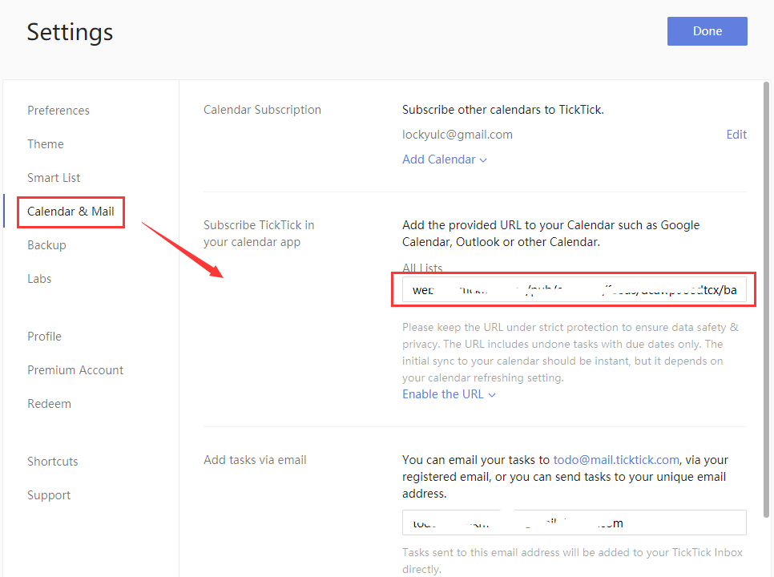

### How to subscribe to TickTick in your own calendar app?

1. Sign in to TickTick on the web.

2. Click the avatar in the upper-left corner of your TickTick homepage, then click "Settings" from the menu that appears.

3. Click "Calendar & Mail" in the left panel.

4. Enable the URL" in the section of "Subscribe TickTick in your calendar app".

5. Add the provided URL to your calendar apps.

