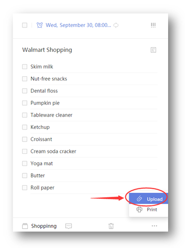

### How to upload attachments to a task?
1.Sign in TickTick to select a task.

2.Click the “···” in the bottom right corner of the page.

3.Select “Upload” to add attachments.

Image, record and frequently used file types such as Word, Excel are all supported.

