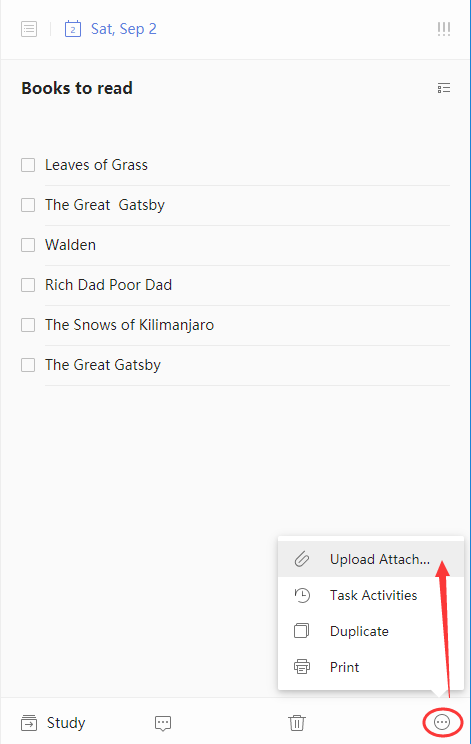

### How to upload attachments to a task?

1. Sign in to TickTick on the web.

2. Click the "···" in the bottom-right corner of the right pane.

3. Click "Upload" to add attachments.

Supported file types include Word, Excel, and various image files.

