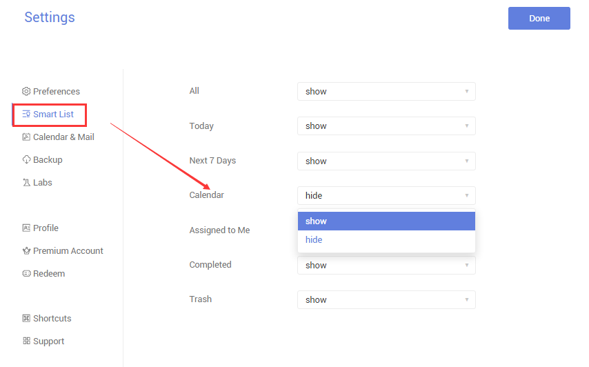
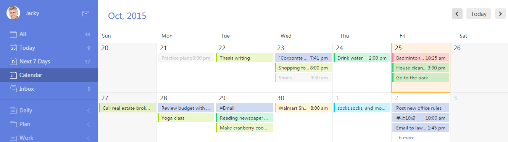

###What is “Calendar View”?<mark>[Pro only]</mark>
“Calendar View” shows tasks based on time frame just like Calendar does, which is more intuitive and clear.

 

**-How to enable “Calendar View”?**

1.Sign in TickTick on web to click the avatar in the upper-left hand corner of the page.

2.Select “Settings” > Click “Smart List” in the left panel.

3.Show Calendar.

4.“Calendar” list will be displayed below Next 7 Days.

You can drag and drop a task from one date to another date. You can click a task to edit it or click a date to add a new task.

