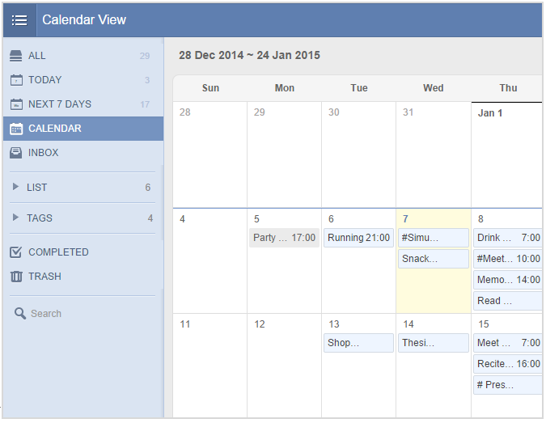

###What is “Calendar View”?<mark>[Pro only]</mark>
“Calendar View” shows tasks based on time frame just like Calendar does, which is more intuitive and clear. It is a premium feature available for Pro users only.

 

**-How to enable “Calendar View”?**

1.Click the avatar on top right corner to enter “Labs” and enable “Calendar View”.

2.Then you will see the “Calendar” tab appear below the “Next 7 Days” on the left panel.

3.Click “Calendar” and you are able to check your tasks in a more familiar way just like in Calendar. Click on any date to add tasks directly or click the task to edit.

