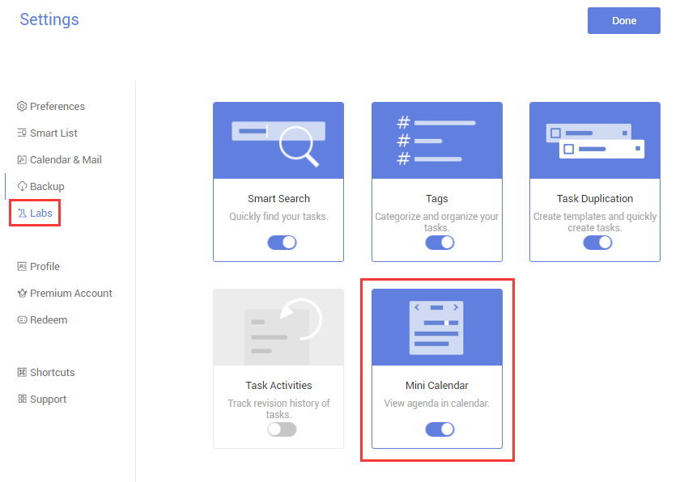
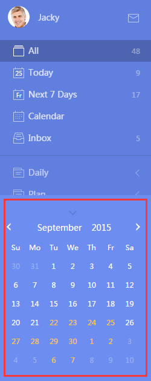

###What is “Mini Calendar”?<mark>[Pro only]</mark>
“Mini Calendar”, just as its name implies, is a small calendar which allows you to know  quickly at which date you have tasks and to add tasks based on a calednar view.

1.Click the avatar in the upper-left corner of the page.

2.Select “Settings” > Click “Labs” to enable “Mini Calendar”.

3.A small calendar will be displayed at the bottom of the left panel.

**-What is Mini Calendar used for?**

Tip 1: The dates which are highlighted with yellow indicate that you have tasks on that day.

Tip 2: If you click a date on the mini calendar, tasks on that day will be displayed in the middle of the page.

Tip 3: You can click a date and create tasks for that day directly.
