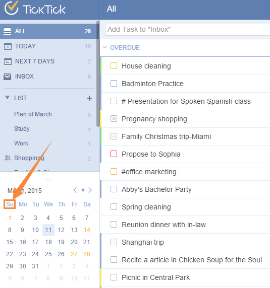

###What is “Mini Calendar”?<mark>[Pro only]</mark>
“Mini Calendar”, just as its name implies, is a small calendar which allows you to know  quickly at which date you have tasks. It is a premium feature available for Pro users only.

1.Click the avatar on top right corner to enter “Labs” to enable “Mini Calendar”.

2.Then, a small calendar will be displayed on the bottom of left panel.

3.The dates highlighted with yellow indicates that there are tasks for that day and clicking on that date will show all related tasks. You can also click any date to add tasks for that day directly.
