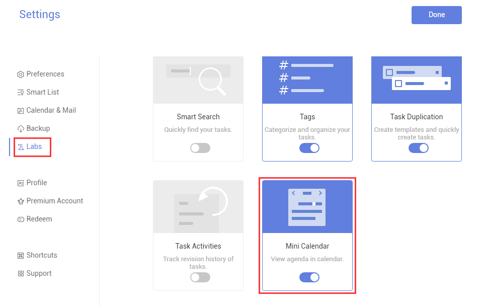

###What is "Mini Calendar"? (Premium)
"Mini Calendar" is a small monthly calendar that, when enabled, appears at the bottom of the sidebar.

1. Click the avatar in the upper-left corner of your TickTick homepage, then click "Settings".

2. Click "Labs" in the left panel and then enable "Mini Calendar" in the right panel.

3. A small calendar will be displayed at the bottom of the left panel.

**What is Mini Calendar used for?**

Tip 1: The dates highlighted in yellow indicate that you have tasks on those days.

Tip 2: If you click a date on the Mini Calendar, tasks on that day will be displayed in the middle of the page.

Tip 3: You can click a date and create tasks for that day directly.

Tip 4. To display or hide the Mini Calendar, click the small button on the top center of the Mini Calendar.