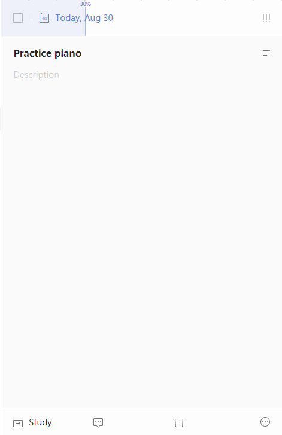

### How to check task progress?

To check your progress in completing tasks organized by checklist view, hover the cursor in the date section of the task \(in the right pane\). There you will see a vertical line representing the percentage of your task that is completed. Click the corresponding percent to confirm task progress.

