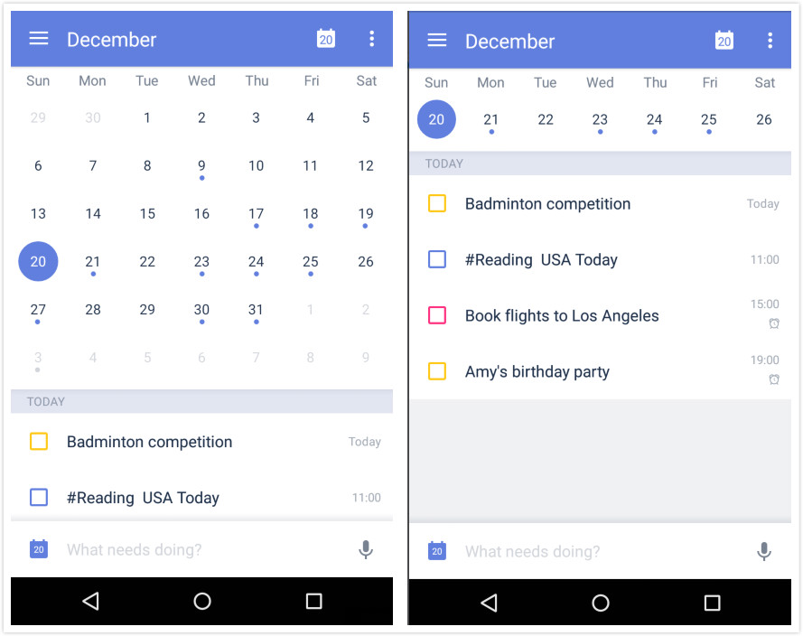
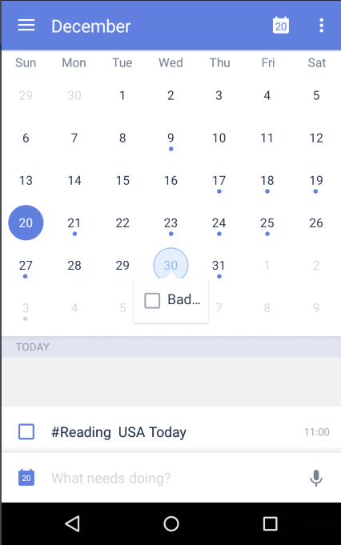

### What is Calendar View?

1. Open TickTick on your Android device, then either swipe to the right or tap the hamburger button in the upper-left corner.

2. Tap "Calendar".

Calendar View shows the traditional grid view of the days of the week so that you can quickly scan your week or month in one glance.

**What’s special to Calendar View?**

* You can view tasks in month view, week view, 3-day view, today view, and list view.
* Highlighted text indicates a task due on that date.
* Click on a date to get a list of tasks for that particular date.

