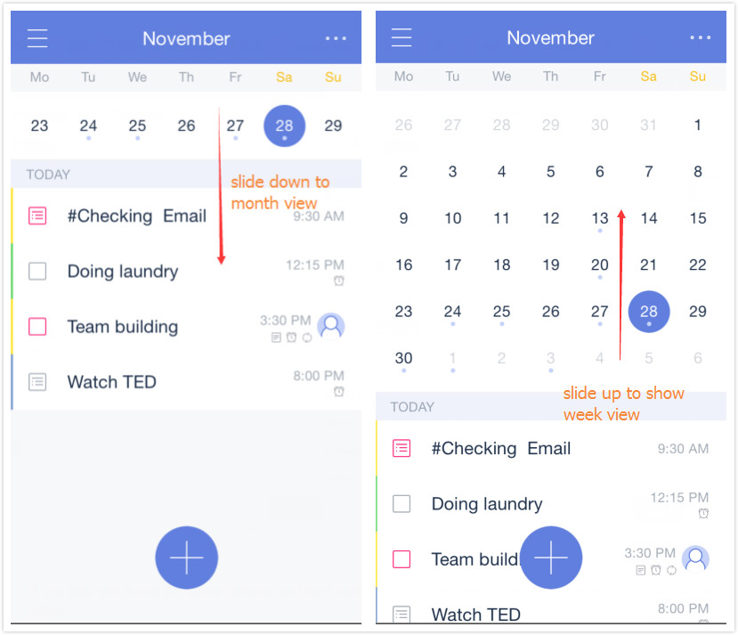
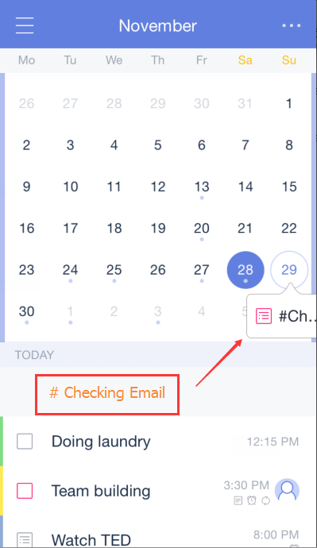

### What is Calendar View?

Calendar View allows you view your tasks with due date in a calendar, which is more intuitive and clear to manage your tasks.

1. Open TickTick on your iOS device and slide the screen to the right.

2. Tap "Calendar" in the List view.

**What’s special to Calendar View?**

1. You can view tasks in week view or in month view by dragging the calendar up or down. Note that a grid view of the calendar month is available only in Pro accounts.

2. The date with a blue dot below indicates you have tasks on that day. Tap it, and tasks will be displayed below.

3. It is easy to change a task's due date. Just press and drag a task to a new date in calendar.

